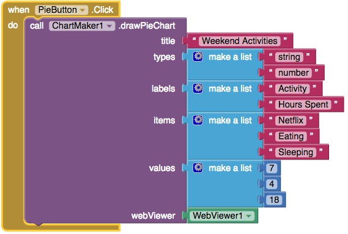
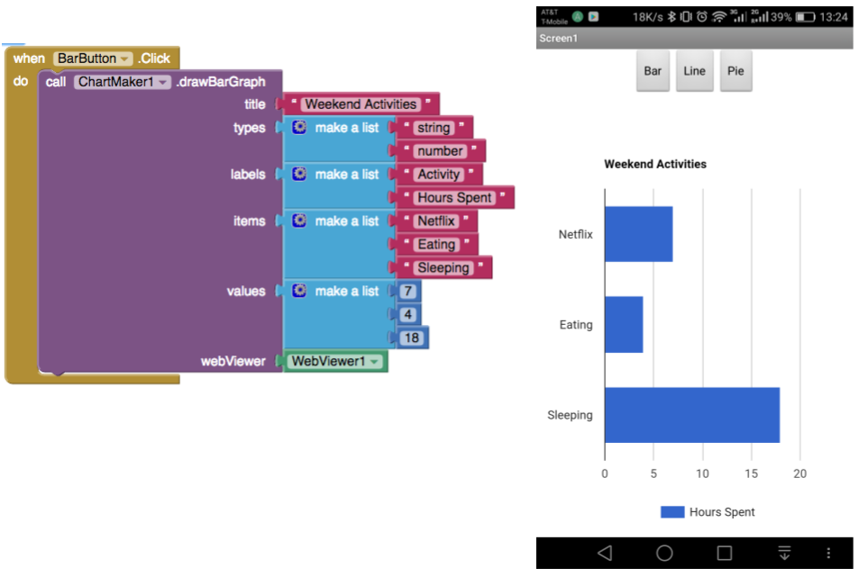
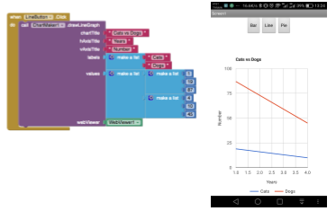

# ChartMaker
An extension for MIT App Inventor that adds graphing capability (for pie, bar, and line graphs) through <a href= "https://developers.google.com/chart/">Google Charts</a>. Created by <a href="https://github.com/laghee">Kate Manning</a> and <a href="https://github.com/ekager">Emily Kager</a> to fulfill a graduate requirement for CS215 at <a href="https://www.mills.edu/">Mills College</a>. 

## How to Use the Extension

Download the extension file (<a href="https://github.com/MillsCS215AppInventorProj/chartmaker/raw/master/edu.mills.appinventor.ChartMaker.aix" download>ChartMaker.aix</a>) and <a href="http://ai2.appinventor.mit.edu/reference/other/extensions.html">import it into your project</a>.
 

We have also created an example App Inventor project (<a href="https://github.com/MillsCS215AppInventorProj/chartmaker/raw/master/ChartMakerExample.aia" download>ChartMakerExample.aia</a>) for you to import and take a look at the blocks and how they can be used.
 

<h3> Example Blocks</h3>

You can see the designated types for each parameter here. To display your chart you will need a WebViewer, which you must pass to the blocks.

